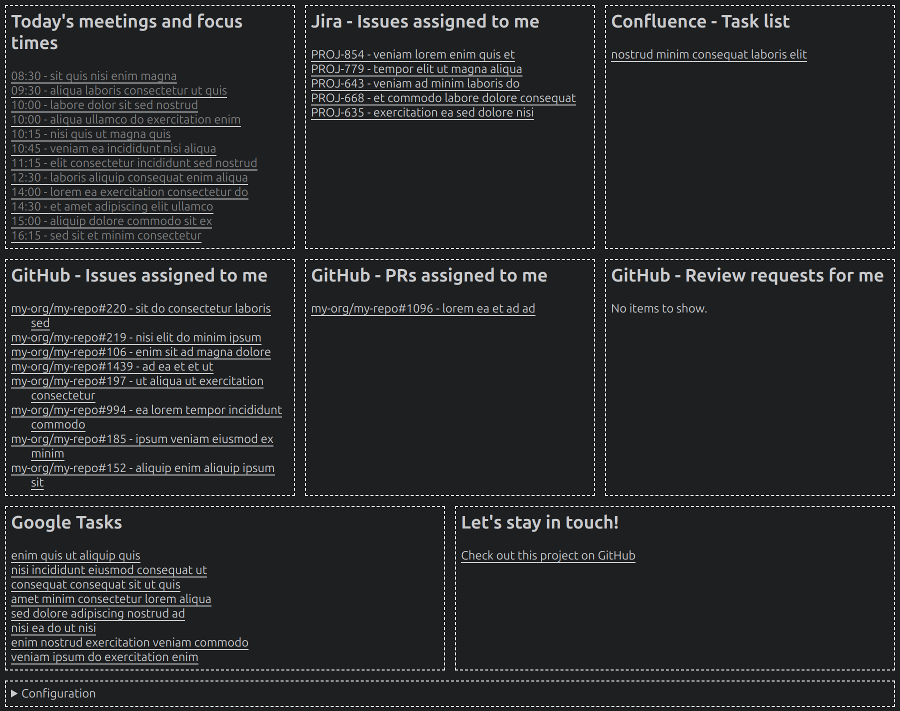

# Work Dashboard Chrome Extension

[](https://github.com/cristiklein/work-dashboard/actions/workflows/pre-commit.yml)

## Overview

The **Work Dashboard** is a Chrome extension that helps you stay on top of your workday by providing you a **single pane of glass** for what you need to do.
It's local-first and displays:

- Google Calendar
- Google Tasks
- Jira Issues assigned to you
- Confluence Tasks assigned to you
- GitHub Issues assigned to you
- GitHub PRs assigned to you
- GitHub Review Requests for you

> [!NOTE]
> Sadly, the [Google Drive API v3](https://stackoverflow.com/questions/65516503/find-files-with-comments-with-google-drive-api-v3) does allow for searching all files with comments assigned to you in a practical way.

## Screenshot


## Installation

### 1. Clone the Repository

To get started with the extension, first clone this repository to your local machine:

```bash
git clone https://github.com/cristiklein/work-dashboard.git
```

### 2. Load the Extension in Chrome

1. Open **Google Chrome** and go to `chrome://extensions/`.
2. Enable **Developer Mode** (toggle at the top right).
3. Click on **Load unpacked** and select the folder where you cloned the repository.

### 3. Pinning the Work Dashboard Extension (Optional)

1. Click the puzzle piece icon in the top-right corner of Chrome.
2. Find Work Dashboard in the list.
3. Click the pin icon next to it to add it to your toolbar.

Now you can access the Work Dashboard by clicking its icon in the Chrome toolbar!

## Setup

### Step 1: Authentication Tokens

For this extension to work, you'll need to authenticate using for the different services (Google, Jira, and Confluence).

- **Google Calendar and Tasks**: The extension will perform authentication with Google (via OAuth) to access your Google Calendar events and tasks.
- **Jira**: You’ll need to create a [Jira Personal Access Token](https://confluence.atlassian.com/enterprise/using-personal-access-tokens-1026032365.html).
- **Confluence**: You'll need to create a [Confluence Personal Access Token](https://confluence.atlassian.com/enterprise/using-personal-access-tokens-1026032365.html).
- **GitHub**: You'll need to create a [GitHub Personal Access Token (classic)](https://docs.github.com/en/authentication/keeping-your-account-and-data-secure/managing-your-personal-access-tokens#creating-a-personal-access-token-classic).

You can configure the Jira, Confluence and GitHub tokens in the Configuration section of Work Dashboard.

## Troubleshooting

While having Work Dashboard open, press F12 to open DevTools, then click on Console.

If you are stuck, report a [bug or questions](https://github.com/cristiklein/work-dashboard/issues).

## Contributing

If you'd like to contribute to the development of **Work Dashboard**, feel free to open an issue or submit a pull request.

Here are a few ways you can contribute:
- Fixing bugs or improving code quality
- Adding new features (like more integrations or more customizable settings)
- Improving the user interface
- Updating the documentation

### How to Contribute

1. Fork this repository.
2. Create a new branch for your changes.
3. Commit your changes and push the branch.
4. Open a pull request.

## Contact

If you have any questions or need support, please [create an issue](https://github.com/cristiklein/work-dashboard/issues).
